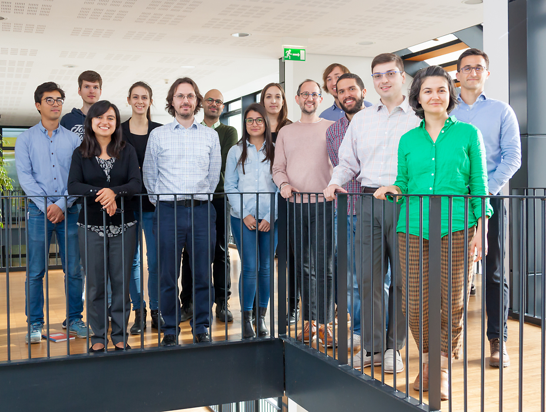
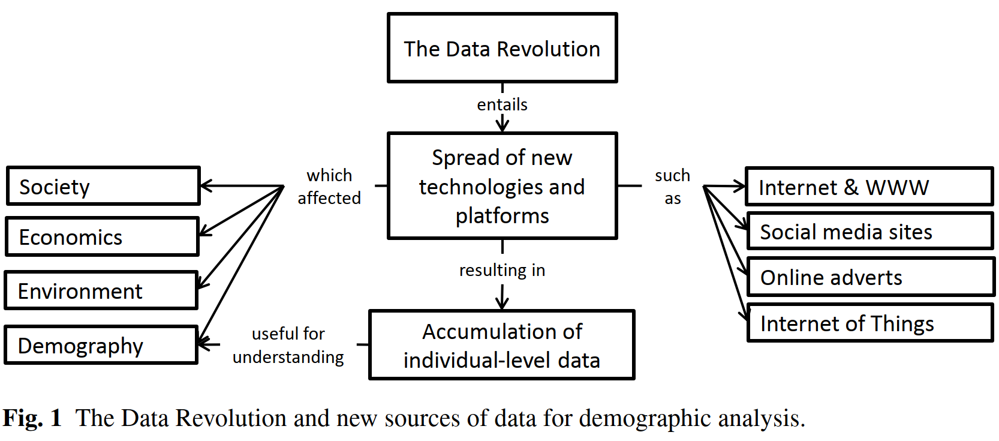
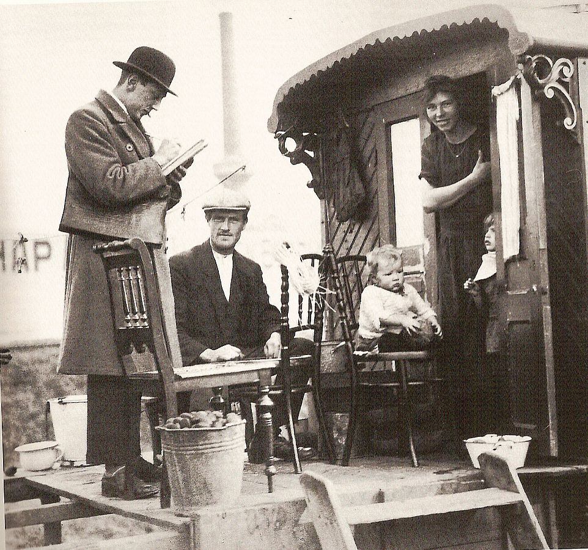
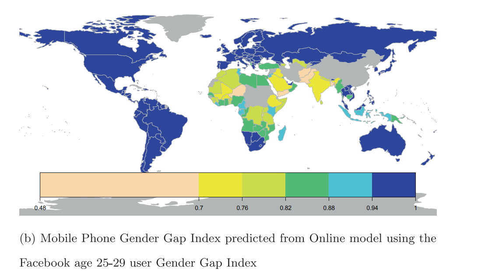
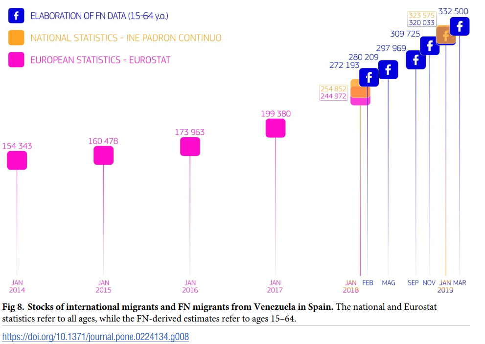
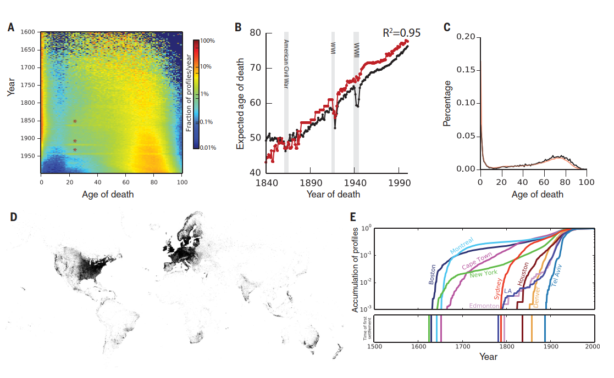
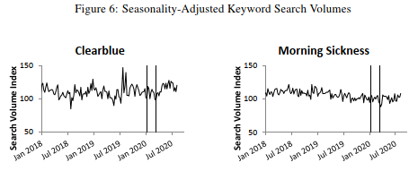

```{r setup, include=FALSE}
knitr::opts_chunk$set(echo = FALSE)
options(tinytex.verbose = TRUE)
```

## Agenda

1. Course setup and final assignment
1. Introduction to digital demography
1. **Break**
1. Current topics


## Hello from the Lab of Digital and Computational Demography!

{width=300px}

\tiny https://www.demogr.mpg.de/en/research_6120/digital_and_computational_demography_5555

# Course setup

## Week's schedule (CEST)

- Monday 10:00–11:30 - “Introduction to digital demography”
- Tuesday 10:00–11:30 - “Digital trace data (1)”
- Wednesday 10:00–11:30 -  “Digital trace data (2)”
- Thursday 10:00–11:30  - “Crowd-sourced online data”
- Friday - No class

## Technical setup

- Online lectures in Zoom + breakout rooms
- Course materials (syllabus, presentations, readings, assignment)
   + https://github.com/alburezg/EDSD22_digital_demography
   + Download complete repository
- Requirements
   + Running installation of RStudio
   + packages: 'tidyverse''knitr', 'rmarkdown', 'data.table'
   + Miktex, Texlive or RStudio's 'tinytex'

## Final assignment

**Goal**

- Hands-on experience using digital trace data
- Changes in human mobility during Covid-19 pandemic

**Exercises**

1. Analyse: raw mobility data from Google, Facebook, and Apple
1. Discuss: data-generating process and data quality

*See full instructions in syllabus!*


## Evaluation

Assignments due Friday February 25 at midnight (Anywhere on Earth): 

1. A written Rmarkdown report (Word document of pdf file). 
1. Include R code as inline chunks
1. Introduction to Rmarkdown: https://rmarkdown.rstudio.com/lesson-1.html

*See full instructions in syllabus!*

# Introduction to Digital Demography

## Who's in the (Zoom breakout) room?

{width=40px}

1. Introduce yourself (if needed)
1. Describe your research interests using ONLY three keywords
1. What is 'digital demography'?
1. Have you ever worked with digital or online data? When?

## Digital and computational demography

1. Apply formal demography to digital trace data\footnote{Cesare, N., Lee, H., McCormick, T., Spiro, E., and Zagheni, E. (2018). Promises and pitfalls of using digital traces for demographic research. Demography 55(5):1979–1999.}
   1. "Digital censuses'' in Facebook and Linkedin
   1. Life tables to estimate *survival* within platforms (users are *born* and *die*)
1. Advance theory\footnote{Edelmann, A., Wolff, T., Montagne, D., and Bail, C.A. (2020). Computational Social Science and Sociology. Annual Review of Sociology 46(1):61–81.}
   1. Demographic (*holy trinity*: mortality, fertility, migration)
   1. Sociological theory (explain social action)

<!-- \tiny \textbf{*} Cesare, N., Lee, H., McCormick, T., Spiro, E., and Zagheni, E. (2018). Promises and pitfalls of using digital traces for demographic research. Demography 55(5):1979–1999. -->

<!-- \tiny $\dagger$ Edelmann, A., Wolff, T., Montagne, D., and Bail, C.A. (2020). Computational Social Science and Sociology. Annual Review of Sociology 46(1):61–81. -->

## What is 'digital' demography?

- Digital vs analogue
- Online vs offline
- 'Big' vs 'small' data

{width=375px}

## Digital data sources for demographic research


1. Digital Trace Data (online and offline)
   a. Social media
   a. Mobile phones
   a. Wearable devices, etc...
1. Crowd-sourced online data 
   a. Wikipedia
   a. DNA and online genealogies
   a. Petitions, etc...
1. Simulations (made-up data)

## Is 'Big data' new data?

{width=250px}

\tiny https://commons.wikimedia.org/wiki/File:Volkstelling_1925_Census.jpg   

## Big data for social research: the good

- big
- always-on
- nonreactive

\tiny Salganik, M. (n.d.). Bit by Bit: Social Research in the Digital Age. Princeton, NJ: Princeton University Press.

## Big data for social research: the bad

- incomplete
- inaccessible
- nonrepresentative (within- and out-of sample)
- drifting (population, behavioural, system)
- algorithmically confounded (observing a casino)
- inaccessible
- dirty
- sensitive

# Break

# Current Topics in Digital Demography

## Make yourself heard!

{width=40px}

1. What are current topics in digital and computational demography?
1. Do you have any particular papers in mind?

## Current topics in digital demography

1. Methodological developments
2. Understand internet users and online use
3. Migration (internal and external)
4. Mortality and morbidity
5. Online and offline fertility dynamics

## 1. Methodological developments

1. Inference from non-representative samples
1. Understand and address online bias
1. Nowcasting demographic processes


## 1. Mobility and Covid-19 dynamics


<!-- \tiny Relative change in visits to groceries and pharmacies and time spent at home  with respect to start of 2020. England \& Wales by region, weeks 8--39, 2020 (15 February -- 25 September). *Source: elaborations of data from Google (2020)* -->

\tiny Basellini, U., Alburez-Gutierrez, D., Del Fava, E., Perrotta, D., Bonetti, M., Camarda, C. and Zagheni, E. (2021). "Linking excess mortality to Google mobility data during the COVID-19 pandemic in England and Wales". SSM - Population Health, 14. DOI: [j.ssmph.2021.100799](https://doi.org/10.1016/j.ssmph.2021.100799).

## 2. Understand internet users and online use

1.  Infer demographics (age, sex, location, SE status, etc) from image and text
1.  Track inequalities in online access
1.  Consequences of platform use for users

## 2. The digital gender gap

{width=350px}

\tiny Fatehkia, M., Kashyap, R., and Weber, I. (2018). Using Facebook ad data to track the global digital gender gap. World Development 107:189–209.


## 3. Migration (internal and external)

1.  Estimate flows and stocks
1.  Mobility by subgroup (eg. undocumented, highly-skilled)
1.  Cultural assimilation of immigrants


## 3. Quantifying international migration

{width=350px}

\tiny Spyratos, S., Vespe, M., Natale, F., Weber, I., Zagheni, E., and Rango, M. (2019). Quantifying international human mobility patterns using Facebook Network data. PLOS ONE 14(10):e0224134. doi:10.1371/journal.pone.0224134.


## 4. Mortality and morbidity

1.  "Historical" mortality estimates (obituaries, genealogies)
1.  Enhanced data collection with IOT and online surveys
1.  Morbidity from online behaviour (digital traces)

## 4. Long-term mortality patterns

{width=350px}

\tiny Kaplanis, J., et al. (2018). Quantitative analysis of population-scale family trees with millions of relatives. Science 360(6385):171–175.


## 5. Online and offline fertility dynamics

1. Estimate fertility from friendship networks
1. Online discourse around reproduction 
1. Partnership formation and assortative mating (online dating)

## 5. Google searches and future fertility

- Google keyword search data
- 15% monthly US birth drop between November 2020 and February 2021



\tiny Wilde, J., Chen, W., and Lohmann, S. (2020). COVID-19 and the Future of US Fertility: What Can We Learn from Google? MPIDR Working Paper. Rostock: Max Planck Institute for Demographic Research. doi:10.4054/MPIDR-WP-2020-034.

## Group discussion

{width=40px}

1. How could you appliy digital data or methods to study a topic you care for?
1. What type of data/expertise would you need?

## Homework

1. Download the course materials from https://github.com/alburezg/EDSD22_digital_demography
1. Review the assignment instructions in the syllabus
1. Use the script in the `Assignment/R` directory to knit an Rmarkdown document
