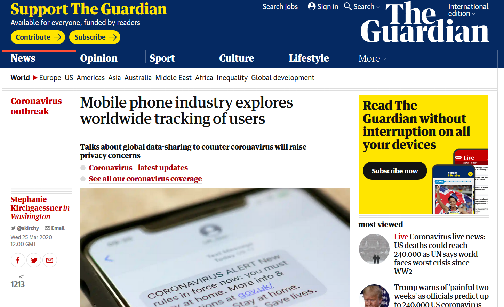
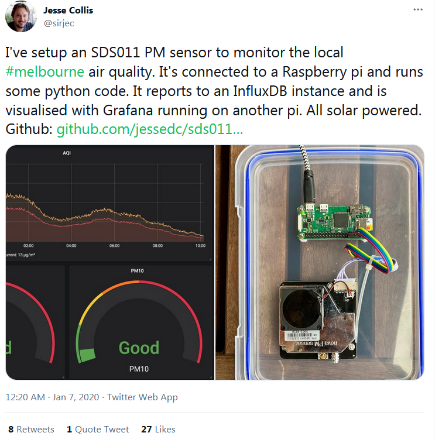
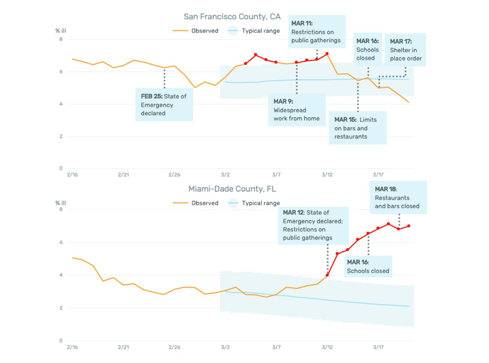
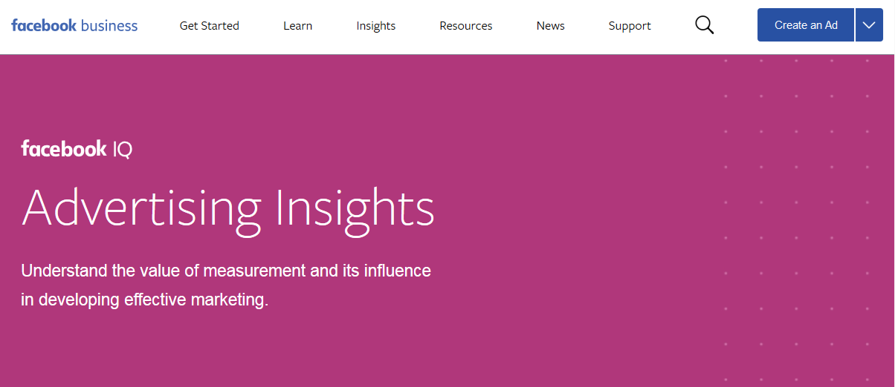
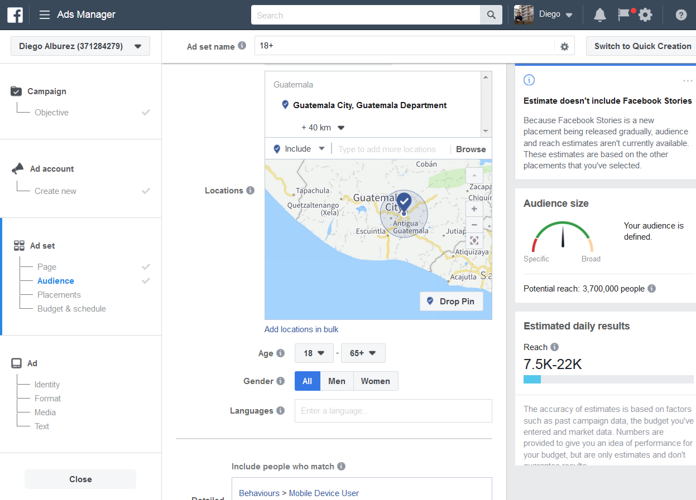
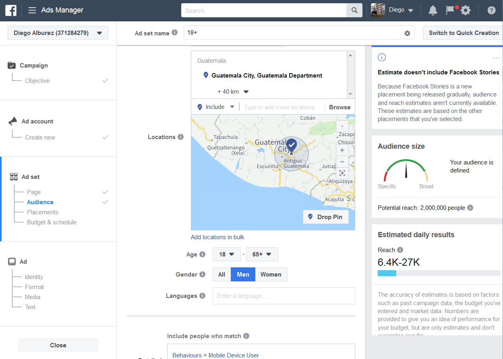
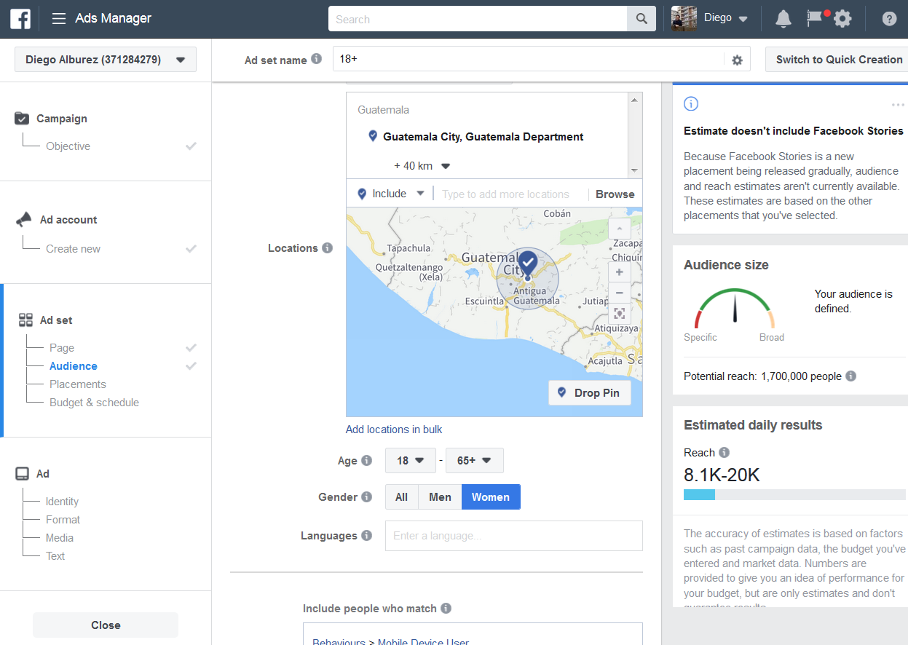

## Agenda

1. Q&A
1. Introduction to digital trace and marketing data
1. **Break** 
1. Example 1: Migration
1. Example 2: Internet users
1. Discussion

## Q&A

- Questions about the final assignment
- Issues accessing the data
- Other?

## Digital traces are by-products of our online presence

- Digital breadcrumbs are unavoidable 
- Pre-GDPR, largely unchecked
- Marketing-led
- Not collected for social-scientific research

## Some data sources (1)

- Marketing platforms
   + Facebook/Instagram/WhatsApp API (META)
   + Linkedin API

## Some data sources (2)

- Online platforms and communication
   + Twitter (API)
   + Google Trends
   + Mobility reports
   + Email, IP address, mobile phones

## Some data sources (3)

- Internet of Things
   + Activity trackers and wearable medical devices
   + Wearable sensors
   
## A contemporary issue

{width=350px}
   
\tiny https://www.theguardian.com/world/2020/mar/25/mobile-phone-industry-explores-worldwide-tracking-of-users-coronavirus

## Anyone can collect data these days

{width=250px}

\tiny Source: https://twitter.com/sirjec/status/1214325789707005953?s=20

## Smart thermometer to track body temperature

{width=400px}

\tiny https://twitter.com/ASlavitt/status/1241569790151593986

## Some data sources

1. Marketing platforms
   + Facebook/Instagram/WhatsApp API
   + Linkedin API
1. Online platforms and communication
   + Twitter (API)
   + Google Trends
   + Email, IP address, mobile phones
1. Internet of Things
   + Activity trackers and wearable medical devices
   + Wearable sensors

## Using online marketing tools for demographic research

{width=400px}

## ‘Audience estimates’: FB users in Guatemala

{width=400px}

## Male FB users, aged 18+ in Guatemala City

{width=400px}

## Female FB users, aged 18+ in Guatemala City

{width=400px}

## Facebook marketing platforms and APIs

- GUI vs API (by hand or programmatically)
- Sofia Gil’s tutorial: https://github.com/SofiaG1l/Using_Facebook_API
- For python users, Carol Coimbra's: https://github.com/carolcoimbra/facebook-ads

## Group discussion

FB audience estimates are used for **micro-targeted advertisment**. 

- *A marketing strategy that uses digital trace to segment audiences into small groups for content targeting.*

{width=40px}

1. How can it be used for demographic research?
1. What are the pros and cons of using it?

## Good practices for digital demography

1. Acknowledge non-representativeness
1. Use IRL data to compare and completment
1. Account for drifting and algorithmic confounding (observing a casino?)
1. Think of ethics, be transparent and upfront

# Break

# Example 1: Migration

## Group discussion

{width=40px}

We'll review two studies. Identify the

1.  **strengths** 
1.  **weaknesses** 

of their reliance on digital trace data.

## Research at a glance

- RQ: Estimate out-migration from Puerto Rico in the months after 2017 Hurricane Maria
- Data: FB advertising platform and American Community Survey (ACS)
- Findings: 
   + Oct 2017 to Jan 2018: 17.0% increase in Puerto Rican migrants  (185K people)
   + Jan to March 2018: 1.8% decrease (return migration)
   + Flows by age, sex, and US State
   

\tiny Alexander, M., Polimis, K. and Zagheni, E. (2019), The Impact of Hurricane Maria on Out‐migration from Puerto Rico: Evidence from Facebook Data. Population and Development Review, 45: 617-630.

## Sanity checks

{width=350px}

\tiny Alexander, M., Polimis, K. and Zagheni, E. (2019), The Impact of Hurricane Maria on Out‐migration from Puerto Rico: Evidence from Facebook Data. Population and Development Review, 45: 617-630.

## Population increase

{width=350px}

\tiny Alexander, M., Polimis, K. and Zagheni, E. (2019), The Impact of Hurricane Maria on Out‐migration from Puerto Rico: Evidence from Facebook Data. Population and Development Review, 45: 617-630.

## Percent change by age groups

{width=350px}

\tiny Alexander, M., Polimis, K. and Zagheni, E. (2019), The Impact of Hurricane Maria on Out‐migration from Puerto Rico: Evidence from Facebook Data. Population and Development Review, 45: 617-630.

# Example 2: Digital use

## Summary

- RQ: Predict internet and mobile phone use gender gaps 
- Data: FB advertising platform and indicators from offline sources
- Estimating rates: Facebook Gender Gap Index:

$$\frac{ \text{Female to male gender ratio of people with characteristic} }{\text{Female to Male gender ratio of the population }}$$

- Findings: 
   + FB measure explained 69% of ground-truth variance
   + Online+offline measure: best estimates

\tiny Fatehkia, M., Kashyap, R., and Weber, I. (2018). Using Facebook ad data to track the global digital gender gap. World Development 107:189–209.

## Measuring the gender gap in real-time

{width=400px}

\tiny https://www.digitalgendergaps.org/data/?report=2020-03-02

# Discussion

## Group discussion

{width=40px}

We'll review two studies. Identify the

1.  **strengths** 
1.  **weaknesses** 

of their reliance on digital trace data.

## Strengths and weaknesses: Puerto Rico migration 

- Con: No 'ground-truth' data (?)
- Con: Non-representative sample
- Con: Algorithmic drifting
- Pro: Real-time data (no delay as in official data)
- Adjust for bias: Difference-in-difference to 

## Strengths and weaknesses: Digital gender gap

- Pro: Nowcasting at sub-national level
- Con: Non-representative
- Pro: 'Ground-truth' data: Internet Gender Gap Index
- Con: No data for China (FB penetratio: 0.2%)
- Adjust for bias: correction factor (internet penetration)

## Challenges going ahead

> Whoever you are… I've always depended on the kindness of strangers.

\flushright - Blanche DuBois, A Streetcar Named Desire

1. Ensuring sustainable data access
1. Addressing systematic bias
1. No information information about algorithms that companies use internally (eg. rounding errors)
1. Privacy and ethical digital research

\tiny Zuboff, S. (2015). Big other: Surveillance capitalism and the prospects of an information civilization. Journal of Information Technology 30(1):75–89.

## Make yourself heard!

{width=40px}

1. What are the main ethical concerns when using digital trace data?
1. Do all/any apply to digital demographers?
1. How can we minimise risk for users?

<!-- ## Homework -->

<!-- - Start with `Exercise 2` -->
<!-- - Think for tomorrow: How does all of this relate to your interests (if at all)? -->