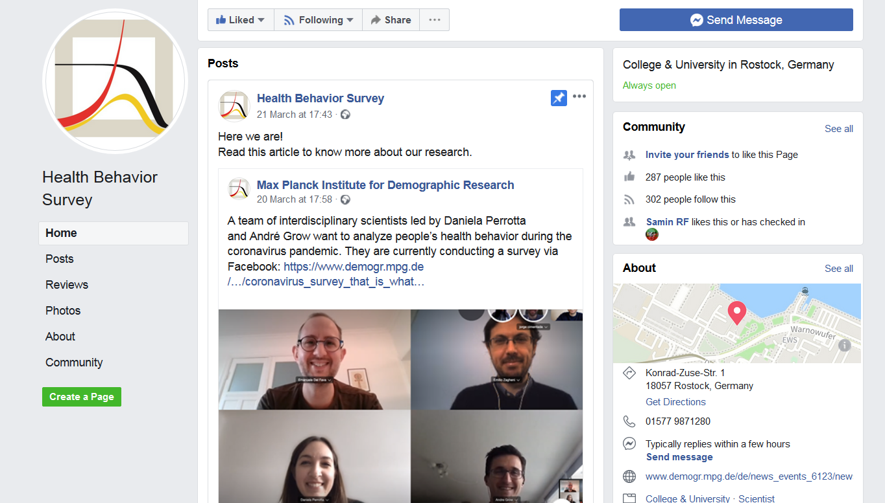

## Agenda

1. Q&A
1. Crowd-sourced data
1. **Break**
1. User-generated family trees
1. Limitations and bias

## Q&A

- Questions about the assignment
- Questions about the study last week
- Other?

# Crowd-sourced data

## What is crowd-sourced data?

- 'Bottom-up' user-generated content
- Usually large
- Available online - may have been produced offline
- By-product of decentralized activity

## Examples in this session

1. Recruitment platforms
1. Family history research

## Group discussion

Consider this image of Twitter user demographics: 

{width=250px}

1. Do you see anything odd?
1. What might be causing the issue?

## Online recruitment + post-stratification

{width=400px}

\tiny Wang, Rothschild, Goel, and Gelman 2015. Forecasting elections with non-representative polls. International Journal of Forecasting, 31 (3).

## Forecasting with non-representative polls

{width=400px}

\tiny Wang, Rothschild, Goel, and Gelman 2015. Forecasting elections with non-representative polls. International Journal of Forecasting, 31 (3).

## An example closer to home

{width=350px}

\tiny Grow, A., Perrotta, D., Del Fava, E., Cimentada, J., Rampazzo, F., Gil-Clavel, S., and Zagheni, E. (2020). Addressing Public Health Emergencies via Facebook Surveys: Advantages, Challenges, and Practical Considerations. Journal of Medical Internet Research 22(12):e20653

# Break 

# Online genealogies

## A genealogy is the history of a population

{width=350px}

## WikiTree

{width=250px}

\tiny Fire, M. and Elovici, Y. (2015). Data mining of online genealogy datasets for revealing lifespan patterns in human population. ACM Trans. Intell. Syst. Technol. 6(2):28:1–28:22.

## Geni.com: a social network for genealogists

{width=350px}

## Built on top of (private) genomic data

{width=350px}

## Our example: Familinx data

1. Genealogy-driven social media data
1. Goal: register entire population of the world
1. 86M unique profiles over last 400 years
1. Curated, with quality checks
1. Geo-coded events - 55% Europe; 30% North America

\tiny Kaplanis, J., et al. (2018). Quantitative analysis of population-scale family trees with millions of relatives. Science 360(6385):171–175.

## Geographic distribution in Familinx

{width=350px}

\tiny Diego Alburez-Gutierrez (2020)

## Population alive by age group (all countries)

{width=350px}

\tiny Diego Alburez-Gutierrez (2020)

## Male bias in online genealogies (Familinx)

{width=250px}

## The data generating process

{width=350px}

\tiny Diego Alburez-Gutierrez (2020)

## A closer look at the data generating process

{width=300px}

\tiny https://blog.myheritage.com/2019/09/myheritage-live-2019-recap/

## The Swedish sample

{width=250px}

\tiny Diego Alburez-Gutierrez and Samin Aref (2020)

## Geographic distribution in Familinx data (sample)

{width=250px}

\tiny Diego Alburez-Gutierrez (2020)

## Bias in lifespan dynamics from online genealogies

{width=350px}

\tiny Stelter, R. and Alburez-Gutierrez, D. (forthcoming). Representativeness is crucial for inferring demographic processes from online genealogies: Evidence from lifespan dynamics. Proceedings of the National Academy of Sciences.

## Correcting bias: an example using post-stratification weights

**Starting point**:
Online genealogies are a non-representative sample of real-world genealogies.

- Online genealogies $\neq$ offline genealogies
- Unknown `weights' - derive from comparison to trusted sources 
- Understand data-generating process
  
\tiny Wang, W., Rothschild, D., Goel, S., and Gelman, A. (2015). Forecasting elections with
non-representative polls. International Journal of Forecasting, 31(3), 980-991.

## Numerator - death events

{width=350px}

## Denominator or exposure

{width=350px}

## 'Corrected' demographic rates (Finland)

{width=350px}

\tiny Chong, Alburez-Gutierrez, Del Fava, Alexander, Zagheni (2022). Identifying and correcting bias in big crowd-sourced online genealogies. MPIDR Working Paper. Rostock: Max Planck Institute for Demographic Research.DOI: [10.4054/MPIDR-WP-2022-005](https://doi.org/10.4054/MPIDR-WP-2022-005).

## 'Corrected' life expectancy (Finland)

{width=350px}

\tiny Chong, Alburez-Gutierrez, Del Fava, Alexander, Zagheni (2022). Identifying and correcting bias in big crowd-sourced online genealogies. MPIDR Working Paper. Rostock: Max Planck Institute for Demographic Research.DOI: [10.4054/MPIDR-WP-2022-005](https://doi.org/10.4054/MPIDR-WP-2022-005).

## Group discussion

{width=40px}

Think about a way in which you could use crowd-sourcing in your own research.

1. Which platform would you use?
1. Which challenges do you foresee?
1. Special measures to protect privacy?

